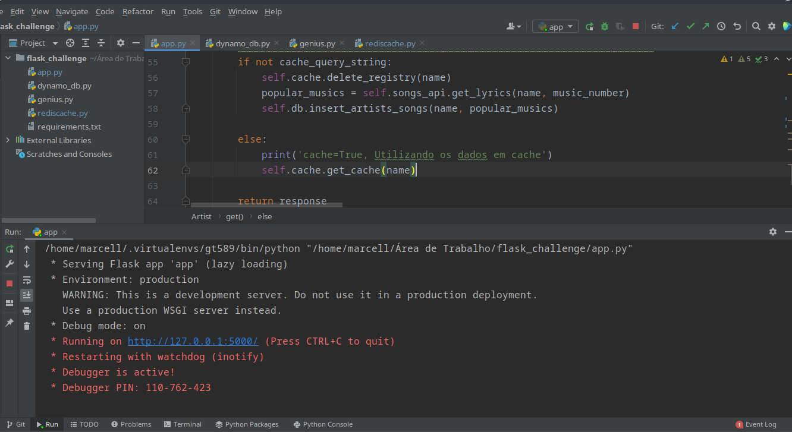
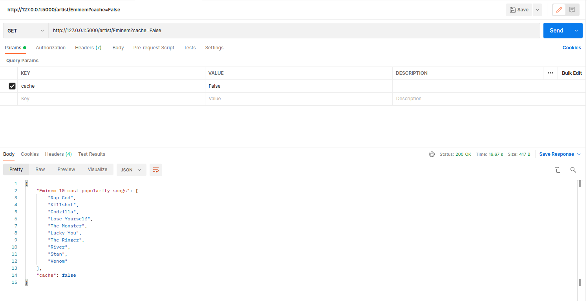
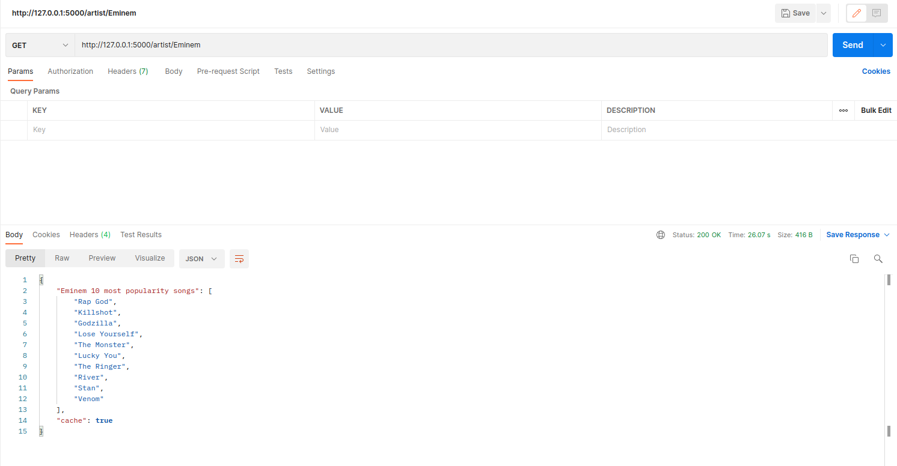

# GeniusFlaskAPI

<!---Esses são exemplos. Veja https://shields.io para outras pessoas ou para personalizar este conjunto de escudos. Você pode querer incluir dependências, status do projeto e informações de licença aqui--->




> API REST desenvolvida em flask que consome dados da api [Genius](https://docs.genius.com/) através da biblioteca [lyricsgenius](https://github.com/johnwmillr/LyricsGenius). Efetua a consulta das 10 músicas mais populares do artista passado como argumento via URN. Armazena em cache no Redis por 7 dias e salva no banco de dados DynamoDB. 
* Caso o artista procurado esteja disponível em Cache Redis, a consulta será feita de forma mais rápida evitando a busca pelo banco de dados DynamoDB. A argumento cache=True pode ser passado via query_string, caso nenhum valor seja identificado o script levará em conta que cache=True.
* Se o argumento query_string for estabelecido como cache= False, será verificado se o artista e suas músicas estão disponíveis em cache, caso afirmativo ele será deletado e inserido no DynamoDB.


## 💻 Pré-requisitos

Antes de começar, verifique se você atendeu aos seguintes requisitos:
* Sistema Operacional ou ambiente virtual Linux.
* Criar conta no [Genius](https://docs.genius.com/) e gerar credenciais
* Instalar a biblioteca [Flask](https://flask.palletsprojects.com/en/2.0.x/) e [Flask-Restful](https://flask-restful.readthedocs.io/en/latest/) 
* Instalar a biblioteca [boto3](https://boto3.amazonaws.com/v1/documentation/api/latest/index.html) para acesso aos recursos AWS
* Instalar o Redis no Python(pip install redis) e no Linux. [passo a passo de instalação do Redis](https://danielcorcoranssql.wordpress.com/2019/03/19/setting-up-redis-cache-with-flask/)
* Possuir uma conta ativa AmazonAWS para acesso ao [DynamoDB](https://aws.amazon.com/pt/dynamodb/), para o access_ID e access_token serem gerados.
* Criar um usuário com permissões de utilização ao [DynamoDB](https://aws.amazon.com/pt/dynamodb/) e credenciais através do [Amazon IAM Role](https://docs.aws.amazon.com/pt_br/IAM/latest/UserGuide/id_roles.html)
* Para consumação de dados da API Genius foi utilizado o [framework](https://github.com/johnwmillr/LyricsGenius) lyricgenius. Instruções de uso em: [Documentação](https://lyricsgenius.readthedocs.io/en/master/reference/types.html#classes)
* A instalação de todos os frameworks utilizados estão disponíveis no requirements.txt 
## ☕ Usando <GeniusFlaskAPI>

Para usar <GeniusFlaskAPI>, siga estas etapas:

  Após configurar o ambiente:
```
clone o repositório: git clone https://github.com/xelel/GeniusFlaskAPI.git
```

 Armazene os valores das credenciais nos scripts: genius.py e dynamo_db.py:
```
class Genius( variável : self.ACCESS_TOKEN), class DynamoDB(variáveis : self.ACCESS_KEY,self.KEY_ID, self.REGION)
```

Execute o script: app.py
 
A API entrará em execução e um link local será gerado para passagem de paramêtros.

Exemplos de uso:
```
http://127.0.0.1:5000/artist/Eminem?cache=False
```
  

```
http://127.0.0.1:5000/artist/Eminem?cache=True
```
  
```
http://127.0.0.1:5000/artist/Eminem
```
  

